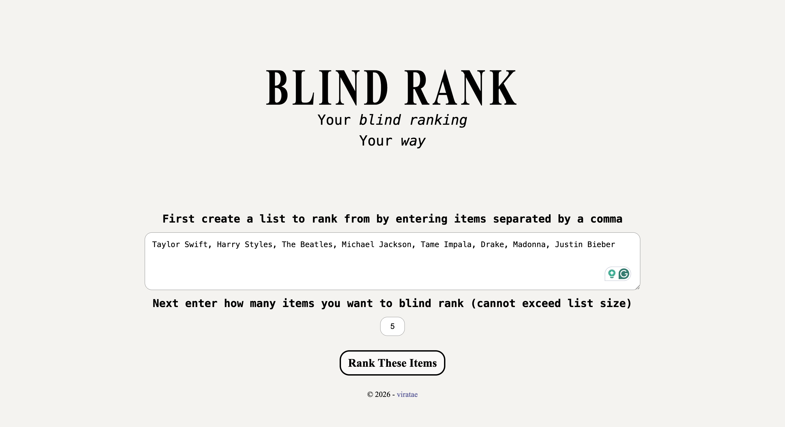
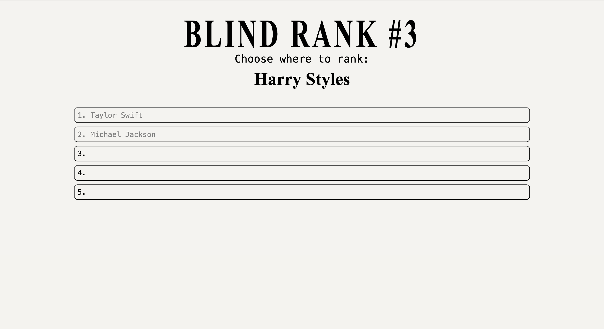
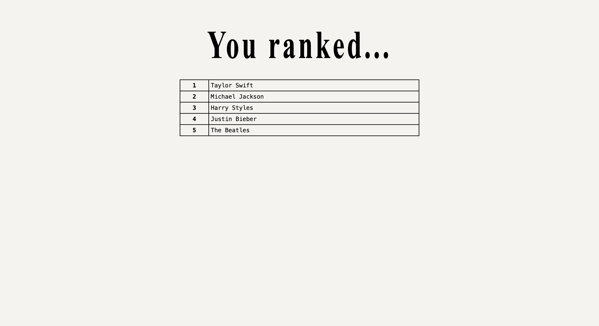

# Blind Rank
### &rarr; [Live Preview](https://viratae.github.io/blindRank/)

### Inspired by Social Media trend, Blind Rank let's you build a custom, randomized blind ranking system to serve your needs

## Features
- Turns user input into a list of iems
- Uses form validation to ensure valid user input
- Displays final ranking result based on user input

## Built With

*(Javascript, HTML, CSS, Git, GitHub, Visual Studio Code)*

## Demo
Insert a list of items. Your rank items will be chosen randomly from this pool

Pick a spot for this item without knowing what's coming next

Regret your choices once the results pop up
